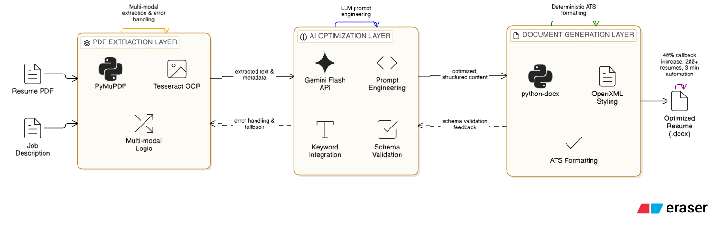

# 📄 Resume Analyzer

## 🧩 Problem Statement
Currently, analyzing resumes against specific job descriptions is inefficient and inconsistent. While paid ATS platforms offer resume–job matching, they are often costly. Free resume analyzers exist, but they provide limited accuracy and flexibility. Although tools like ChatGPT can be used for resume analysis, users must manually craft and repeat prompts for every new job description, which introduces additional effort and inconsistency in results.

---
## 💡 Solution
To address these challenges, we propose building a custom Resume Analyzer that automatically evaluates a candidate’s resume against a given job description..

The system:
- Accepts **Job Description (JD)** and **Resume** as inputs
- Performs **structured and consistent analysis** without repeated manual prompts
- Provides resume match insights comparable to ATS tools
- Reduces cost while improving usability and efficiency

---

## 🎯 Goal
Build a **cost-effective, automated Resume Analyzer** that:
- Accurately evaluates resumes against job descriptions
- Clearly shows how well a resume aligns with a JD
- Eliminates repetitive manual prompt creation

---

## 🚀 Impact
- Automated resume–JD analysis using LLMs
- Reduced dependency on paid ATS platforms
- Delivered consistent, readable, and actionable resume matching insights

---

## 📋 Requirements

### Functional Requirements
- Input:
  - Resume (PDF / DOC)
  - Job Description (Text)
- Extract and analyze:
  - Skills
  - Experience
  - Role relevance
- Identify gaps between resume and JD
- Provide suggestions to improve resume alignment
- Output should be in a **clear and readable format**

---

## 🧠 High-Level Design

### Job Description Classification
The JD is broken into three categories:
1. **Must Have** – Mandatory skills and experience
2. **Good to Have** – Preferred but optional skills
3. **Additional Criteria** – Nice-to-have qualifications

---

### System Flow

